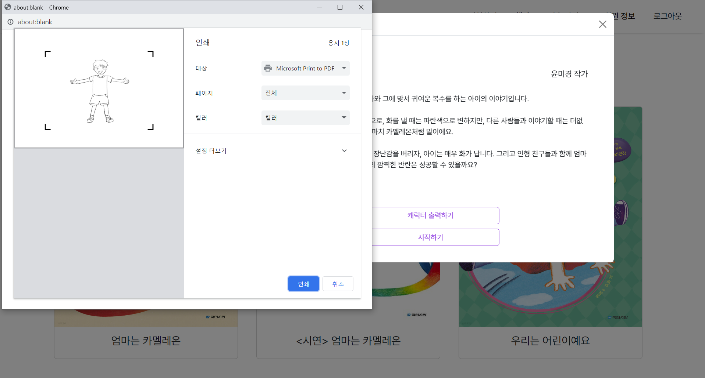

### "그림이 나를 따라 움직여요!"

 

### 🖍 스케치북 소개:
**IoT기반의 유아 참여형 동화 프로그램 :"스케치북"** 아이와 동화가 상호작용 할 수 있는 IoT 프로젝트로, 아이가 그린 그림이 동화의 주인공이 되어 미션을 수행하며 상상력을 자극할 수 있게 구현한 프로젝트입니다. 연장보육반 아이들을 대상으로 교육적 활동을 지원하고자 기획하게 되었습니다. 

 

웹 사이트 링크: https://i9c102.p.ssafy.io/ 
 

## 목차
- [개요](#개요)
- [팀 소개](#팀소개)
- [발표자료](#발표자료)
- [UCC](#UCC)
- [기획배경 & 타겟](#target-people)
- [기능구현](#기능구현)
- [사용기술스택](#사용기술스택)
- [페이지 소개](#페이지소개)
- [산출물 및 협업툴](#산출물)

 

## 개요
- 프로젝트 이름 : 스케치북
- 프로젝트 기간 : 2023.07.03. ~ 2023.08.18.

## ✨ 팀소개 
<!-- ( 깃헙아이디(넣자! / 증명사진) 넣을지? -->

|   **Name**   |                서정빈                 |                김진주                |                  박근창                   |               안민                |                 이지은                  |               조찬익                |
| :----------: | :-----------------------------------: | :----------------------------------: | :---------------------------------------: | :---------------------------------: | :-------------------------------------: | :---------------------------------: |
| **Profile**  |     |    |         |   |       |   |
| **Position** |    Team Leader   Release/Backend   |      Frontend   Developer        |         Hardware   Developer         |        Frontend   Develper      |         FrontEnd   Developer         |         Backend   Developer         |

 

## 발표자료
<!-- [다운로드](data/공통PJT_광주_1반_C102_스케치북.pptx) (*.pptx) -->

 

## UCC
<!--  -->

 

### ✔️ 기획배경 & 타겟 
 
- 기획 배경

    1. 늘어나는 야간 연장 보육 시설과 이에 반해 부족한 연장 보육반 프로그램
    2. 교육적인 프로그램을 원하는 학부모들과 혼합반 운영으로 수요를 맞추기 어려운 어린이집 실정
    3. 아이와 보육교사를 만족시킬 수 있는 유아 참여형 동화 프로그램 개발

 
- 타겟층

    - 어린이집 연장보육반 아이들과 보육교사
    - 창작 동화 작가
 
- 서비스 소개

    - 아이가 그린 캐릭터가 동화의 주인공이 되는 설정
    - 기기 연결 후 아이의 모션을 인식하여 캐릭터와 일체화 시켜 미션 진행  
    - 비회원도 체험하기를 통해 서비스 맛보기 가능 

## 기능구현

- Back-end

  -  회원가입, 아이디 중복체크, 로그인, 로그아웃, 이메일 인증, 이메일 인증 확인, 임시비밀번호 발급, 비밀번호 변경
  - 기기연결 OTP 발급, OTP 확인, 기기연결 해제, 각 페이지 별 기기 작동 명령, 캡처이미지 저장, 기기에서 측정한 위치데이터
  - 회원가입시 nodemailer 이용하여 이메일 인증번호 전송
  - 비밀번호는 bcrypt 이용하여 암호화해서 저장
  - JWT토큰을 발급해 로그인을 유지시키도록 함
  - 기기 연결 OTP는 OTP-generator 이용하여 redis에 저장

 

- Front-end
    - react-router를 통한 페이지 분할 및 ProtectedRoute/PublicRoute 구분을 통해 url 직접 접근 차단
    - react-router의 children과 outlet을 통해 새로고침 되지 않는 페이지 전환 구현(사용자 UX 개선)
    - props를 통한 상위/하위 컴포넌트간 데이터 전송, querystring을 통한 페이지 간 데이터 전송
    - axios를 통한 backend 서버와 통신
    - useState를 통한 상태 관리
    - backend 서버에서 보낸 캐릭터 좌표를 css 뷰포트 좌표로 변환하여 화면상에 캐릭터 이미지 표출
    - getBoundingClientRect()를 사용하여 타겟 요소의 위치 파악, 미션 구현
 

- HardWare

 

## 📚 사용기술스택

- Front-End
    - React
    - styled-components
    - react-bootstrap    
- Backend
    - Database: MongoDB, Redis
    - Web: NodeJS
- Hardware
    - Raspberry: TensorFlow Lite, MoveNet, OpenCV
- CI/CD
    - Docker
    - Jenkins
    - Nginx
- Web Service 
    - AWS EC2

| Tech         | Stack                                  |
| ------------ | -------------------------------------- |
| **Language** | JavaScript, Python                     |
| **Backend**  | NodeJS, JWT                            |
| **Frontend** | React                                  |
| **Database** | MongoDB, Redis                         |
| **Server**   | AWS EC2                                |
| **DevOps**   | Git, Docker, Jenkins                   |

## 페이지소개
### 1. 메인페이지
||
|:----:|
|메인 페이지는 로그인과 회원가입 탭으로 구성하여 각각의 기능을 구현하였습니다. 각 폼은 유효성 검사를 통해 적절한 이메일과 비밀번호 형식을 작성할 수 있도록 하였고, 회원가입은 OTP를 발송하여 이메일 인증을 거친 후 진행할 수 있습니다.|

### 2. 서비스 소개
| 로그인 시 | 비로그인 시 |
|:----:|:----:|
|||
|로그인 시, 스케치북 로고를 통해 서비스 소개 페이지 접속 가능|비로그인 시, 로그인 페이지 하단 "어떤 서비스인가요?"를 통해 접속 가능|
<tr>
    <td colspan="2">서비스 목표와 서비스의 기획 배경, 팀원 소개 등의 컨텐츠를 확인할 수 있습니다. </td>
  </tr>

### 3. 회원정보
||
|:----:|
|비밀번호 변경과 기기연결 상태에 대한 정보를 알 수 있습니다. 마스킹된 비밀번호를 미리볼 수 있는 기능을 추가하였으며, 비밀번호 유효성 검사를 통해 적절한 형식의 비밀번호를 설정하도록 표시합니다.|

### 4. 이용 가이드
||
|:----:|
|이용 가이드는 서비스 이용을 위한 각 단계를 그림과 함께 직관적으로 보여주고, 각 박스 위로 마우스를 올리면 구체적인 설명이 나타나도록 구성하였습니다. 서비스 이용에 필요한 기기 연결로 이어지는 버튼을 추가하여 사용자 경험을 연결되도록 하였습니다.|

### 5. 기기연결
||
|기기 연결 페이지는 기기 연결을 위한 각 단계를 그림과 함께 직관적으로 보여주고, 각 박스 위로 마우스를 올리면 구체적인 설명이 나타나도록 구성하였습니다. OTP 생성 버튼을 누르면 OTP번호가 모달로 나타나며, 유효|

### 6. 책장
| 책장 | 출력하기 |
|||
 

### 7. 기기 환경 설정
||

### 8. 동화
||

 

#🔨  시스템 아키텍쳐

\